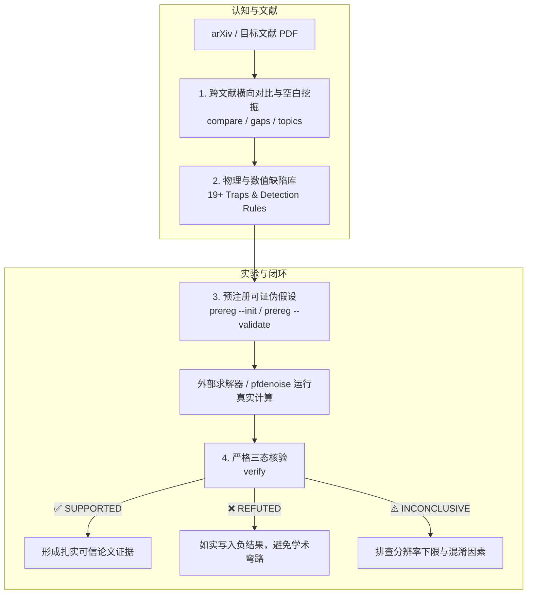

<div align="center">

# 🔬 FieldMate

### AI Agent 的物理与数值常识护栏 · 相场与几何处理科学认知核验工具
**The Physics Guardrail & Falsifiable Research Copilot for Phase-Field and Geometry Processing**

[](LICENSE)
[](https://www.python.org/)
[-brightgreen.svg)](pyproject.toml)
[](tests/)
[](#-一键挂载到主流-agent-harness)

**“不只总结论文，更拦截代码里的物理硬伤；不靠直觉改指标，让每一个科研主张真实可证伪。”**

[痛点直击](#-为什么需要-fieldmate) • [60 秒极速上手](#-60-秒极速上手) • [四大核心支柱](#-四大核心支柱) • [Agent Harness 挂载](#-一键挂载到主流-agent-harness) • [实测踩坑档案](#-真实学术踩坑档案) • [设计契约](#-面向-harness-的工业级集成契约-h1h6)

</div>

---

## ⚡ 为什么需要 FieldMate？

当大语言模型与 AI 编码助手（如 Claude Code, Codex, Antigravity, Cursor）开始自主执行计算数学、偏微分方程（PDE）仿真与三维几何处理任务时，它们极易陷入**“看似能跑通，实则全错”**的学术黑洞：

```
传统通用 Agent：
读了 20 篇论文摘要 ──► 盲目搬运公式 ──► 跑了 1000 步模拟 ──► 发现界面根本不动 / 体积缩水 90%
                                              └──► 悄悄改掉评测指标自欺欺人 (HARKing)
```

```
搭载 FieldMate 的 Agent：
全文深度比对 ──► 识别 19+ 物理/离散缺陷 ──► 事前预注册可证伪假设 ──► 严谨核验真实实验 ──► 直面真实负结果
```

### 真实典型“翻车”场景与 FieldMate 拦截对比

| 经典学术与工程暗坑 | 表面现象 | 真实物理 / 数值根因 | FieldMate 如何事前拦截？ |
|---|---|---|---|
| **时间步量纲陷阱** | 代码跑了 1000 步，相场界面几乎纹丝不动 | 论文公式带 $\epsilon^2 \Delta \phi$，但印刷的 $\Delta t = 0.05h^2$ 对应无前缀写法，量纲差了 $1/\epsilon^2$ 倍 | **`D-RES-001` 规则**：静态分析算子与 CFL 条件，毫秒级告警量纲不匹配 |
| **液滴自发溶解腐蚀** | 几何去噪后，物体体积缩水 90% | 纯 Allen-Cahn 是曲率驱动流，有限正相测度受毛细压力必然收缩至零 | **`D-MOD-001` 规则**：强制保真项/拉格朗日体积守恒乘子检验 |
| **Cahn–Hilliard 四阶刚性爆炸** | 迭代到第 4 步浮点溢出，直接报 `NaN` | Cahn–Hilliard 引入四阶双调和算子 $\Delta^2$，显式步长上限 $\Delta t \sim h^4 / (6M\epsilon^2)$ 严苛数个量级 | **`D-RES-002` 规则**：拦截步长复用，阻断 CFL 崩溃 |
| **自欺欺人的无标签评测** | Noise2Noise 一致性指标暴涨，但点云被抹成平地 | 恒等变换（不做任何处理）对一致性指标有单调奖励 | **`D-EVA-002` 规则**：强制引入 Identity 基线与分辨率下限 $h/2$ |
| **事后粉饰指标 (HARKing)** | 论文里的结论永远“显著优于基线” | 实验跑出负结果后，悄悄换掉评价指标或重调超参 | **`prereg` + `verify` 机制**：事前锁定主张，核验推翻项如实写入负结果 |

---

## 🚀 60 秒极速上手

### 1. 安装 (开箱即用)

```bash
# 推荐：安装核心与 PDF 全文抽取后端
pip install -e ".[pdf]"

# 极致轻量：零外部依赖（纯 Python 标准库即可运行全部规则与预注册核验）
pip install -e .
```

### 2. 一键挂载到主流 Agent Harness

无需手动编写复杂的 Prompt 或工具胶水代码，一行命令挂载至当前工程：

```bash
# 挂载到当前工作区（支持 antigravity, claude, codex, cursor, zcode）
python -m fieldmate install-skill --host antigravity

# 或全局挂载到用户根目录
python -m fieldmate install-skill --host claude --global
```

### 3. 三步科研闭环体验

```bash
# Step 0: 环境体检（零依赖，秒级检查数据完整性与编码）
python -m fieldmate doctor

# Step 1: 扫描领域空白与未报告项（自动过滤摘要假信号，输出可执行精进点）
python -m fieldmate gaps --corpus fieldmate/libraries/corpus_bulk.json --min-n 8

# Step 2: 运行真实实验核验（对照预注册，直面负结果，拒绝伪造）
python -m fieldmate verify --prereg examples/prereg_exp-pfdenoise-002_conserved.json \
                          --results examples/results_exp-pfdenoise-002_conserved.json
```

---

## 🧩 四大核心支柱



### 支柱 ①：跨文献横向对比与空白挖掘 (`compare` / `gaps`)

给出一组检索式或本地 PDF，生成可直接写入顶会/期刊论文的方法对比矩阵与学术精进点：

```bash
# 生成高密度 Markdown 横向对比矩阵
python -m fieldmate compare --corpus fieldmate/libraries/corpus_bulk.json --format markdown

# 挖掘真实精进点（严格遵循证据强度分级）
python -m fieldmate gaps --corpus fieldmate/libraries/corpus_bulk.json --min-n 10
```

- **三态语义设计（严禁空穴来风）**：
  - `✓`：确认提及。
  - `—`：确认未提及（仅当确实通读过全文时才断言）。
  - `?`：只有摘要、没有全文，**无法判定，不作为证据**。
- **证据分级（`STRONG` / `MEDIUM` / `WEAK`）**：
  - 只有当缺失的条目中 $\ge 60\%$ 已解析全文，才评定为 `STRONG` 级机会；
  - 摘要不写参数属于体裁习惯，不抓全文时退出码返回 `4`，严格杜绝拿假信号立项。

---

### 支柱 ②：相场与几何物理缺陷库 (`patterns` / `doctor`)

内建 19 条经过实测验证的真实物理、离散与工程缺陷库（`defect_patterns.jsonl`），配合 16 条确定性机器检测规则：

| 缺陷分类 | 条数 | 代表性痛点 | 物理与数值本质 |
|---|---|---|---|
| **Reproducibility (可复现性)** | 5 | $\lambda$ 符号反向、$\Delta t$ 遗漏 $\epsilon^2$ 前缀、边缘核记号混淆 | 印刷公式与稳定实现不符，导致模拟不动或发散 |
| **Evaluation (评测失真)** | 5 | 未报分辨率下限、N2N 被恒等变换单调奖励、噪声分布不可迁移 | 评测协议存在漏洞，将离散网格误差当做算法精度 |
| **Engineering (工程缺陷)** | 4 | 退化时静默兜底、近邻偏移错向、亚格点重心平移、Hausdorff 索引复用 | 算法退化被隐藏，或由于坐标基准偏移产生包围盒级误差 |
| **Modeling (物理建模)** | 2 | 纯 AC 腐蚀液滴、目标场使用 $0/1$ 而非 $\pm 1$ | 违背双阱自由能梯度流的物理规律 |
| **Discretization (离散格式)** | 2 | 双阱势刚性爆炸、Cahn–Hilliard 四阶步长失稳 | 显式 CFL 步长受高阶导数极大制约 |
| **Differentiability (可微计算)** | 1 | 逆向自动微分反向轨迹显存瓶颈 | 步数过多导致反向传播计算图内存爆炸 |

```bash
# 查看全部缺陷库与机器检测规则映射状态
python -m fieldmate patterns
```

---

### 支柱 ③：可证伪实验预注册与防洗脑核验 (`prereg` / `verify`)

“最贵的失败不是程序崩溃，而是跑完实验后修改指标让它看起来对。” FieldMate 强制在开跑实验前固化主张：

```bash
# 1. 导出预注册模板
python -m fieldmate prereg --init exp-001 --out prereg.json

# 2. 预注册机器自检（认输条件、必要对照、量化下限检查）
python -m fieldmate prereg --prereg prereg.json

# 3. 运行实测核验
python -m fieldmate verify --prereg prereg.json --results results.json
```

- **三大判据**：
  - `SUPPORTED`：预注册方向成立，且效应量超过分辨率下限 $1.5 \times \text{res\_floor}$。
  - `REFUTED`：预注册方向不成立，且无已知混淆因素解释 $\rightarrow$ **如实写入论文负结果**。
  - `INCONCLUSIVE`：方向虽不符或数值发散（NaN/Inf），但误差落入分辨率噪声区间，当前实验无法区分设置不足与方法缺陷。
- **事后补注册拦截**：比对结果文件生成时间与预注册时间戳，严防事后诸葛亮。

---

### 支柱 ④：按阅读目的渐进披露阅读卡 (`read`)

面向不同科研任务，动态展开论文槽位，避免 LLM 阅读全文时的均匀 Token 浪费：

```bash
# 场景 A：我打算超越这篇论文（展开核心假设与现有局限）
python -m fieldmate read --purpose beat --l2

# 场景 B：我打算复现这篇论文（展开数值格式、离散参数与边界条件）
python -m fieldmate read --purpose implement --l2
```

| 阅读目的 | 重点展开槽位 | 核心收益 |
|---|---|---|
| `implement` (复现) | **Protocol (网格/时间步/边界), Mechanism (方程)** | 直击数值离散细节，避开摘要套话 |
| `beat` (超越) | **Assumption (简化假设), Gap (未解难题)** | 快速定位现有方法的边界与脆弱点 |
| `cite` (引用) | **Claim (主要贡献与主张)** | 1 秒提取精确贡献陈述 |

---

## 🔌 一键挂载到主流 Agent Harness

FieldMate 采用纯无状态设计（H1 契约），天然兼容各类自主智能体框架：

### 1. 支持宿主与对应路径

| 智能体宿主 | 挂载方式 | 配置文件生成路径 |
|---|---|---|
| **Antigravity** | `python -m fieldmate install-skill --host antigravity` | `.agents/skills/fieldmate/SKILL.md` |
| **Claude Code** | `python -m fieldmate install-skill --host claude` | `.claude/skills/fieldmate/SKILL.md` |
| **Codex CLI** | `python -m fieldmate install-skill --host codex` | `.codex/skills/fieldmate/SKILL.md` |
| **Cursor IDE** | `python -m fieldmate install-skill --host cursor` | `.cursor/rules/fieldmate.md` |
| **ZCode / 通用** | `python -m fieldmate install-skill --host zcode` | `skills/fieldmate/SKILL.md` |

### 2. MCP (Model Context Protocol) 模式

```bash
pip install -e ".[mcp]"
python -m fieldmate.adapters.mcp.server
```
提供 `compare_literature`、`mine_gaps`、`verify_experiment` 等 10 项标准化 MCP 工具。

---

## 📑 真实学术踩坑档案

FieldMate 绝非空想设计，其每一个规则都凝结了真实课题组的试错与调试数据：

### 档案 1：arXiv 检索在计算数学方向的“全军覆没”

在开发初期，我们尝试使用 `all:"phase field" AND all:denoising` 检索 arXiv，返回 7 篇论文：
- **实测纯度**：**0 / 7** 篇真正做相场去噪。
- **根因分析**：现代深度学习社区将 `denoising` 一词牢牢绑定为“去噪扩散模型 (Denoising Diffusion)”，将材料与微结构生成文献大量拉入；
- **破局方案**：引入计算数学双轨语料机制（`corpus.json` 指定期刊目标论文 + 专属 PDE 词汇表 `libraries/queries.json`），纯度提升至 $100\%$。

### 档案 2：网络端点 406 绕行与下载对拍

批量抓取 arXiv 全文时大量条目下载失败。经抓包对拍发现：
- `https://arxiv.org/pdf/{id}.pdf` 失败率高达 **100% (0/3)**；
- `http://export.arxiv.org/pdf/{id}` 成功率达到 **100% (3/3)**；
- 决定抓取成败的核心在于**主机端点与无后缀 URL**，而非伪装浏览器 User-Agent。FieldMate 已将该策略固化至自适应网络层。

---

## 📋 面向 Harness 的工业级集成契约 (H1–H6)

- **H1 无状态 (Stateless)**：进程内不持久化状态，一切输入输出基于命令行参数与文件系统；
- **H2 契约显式 (Explicit Exit Codes)**：
  - `0`: 成功且有 `STRONG` 级精进点；
  - `1`: 参数校验失败或预注册不合格；
  - `2`: 数据源不可达（arXiv 异常或 PDF 无法解析）；
  - `3`: 语料存在技术线真空（`coverage` 命令）；
  - `4`: **无 STRONG 级候选（拒绝为假信号立项，避免浪费算力）**；
  - `5`: **核验主张被真推翻（负结果如实呈现）**。
- **H3 零 LLM 硬绑定**：核心流程（比对、预注册、体检、核验）100% 基于确定性算法；
- **H6 显式失败 (Fail Loud)**：拒绝静默兜底，遇到分辨率塌缩或 NaN 发散立即抛出清晰诊断。

---

## 🛠️ 性能与精度体检

```bash
# 运行完整单元测试集 (191 个测例)
pytest

# 运行规则体检（基于人工标注 gold set 测量精确率与召回率）
python -m fieldmate evaluate
```

---

## 📜 引用

如果您在研究、论文发表或智能体工作流中使用了 FieldMate，请引用本项目及相关方法学依据：

```bibtex
@software{fieldmate2026,
  author = {0G-Bhqc},
  title = {FieldMate: An Agentic Research Copilot and Physics Guardrail for Phase-Field and Geometry Processing},
  year = {2026},
  url = {https://github.com/0G-Bhqc/fieldmate}
}
@article{pointclouddenoise-survey2025,
  title = {A Survey of Deep Learning-based Point Cloud Denoising},
  journal = {arXiv:2508.17011},
  year = {2025}
}
@book{knoll2001reproducibility,
  title = {Reproducibility of Scientific Investigations},
  author = {Knoll, George},
  year = {2001}
}
```

## 📄 License

本项目采用 [MIT License](LICENSE) 开源许可证。
